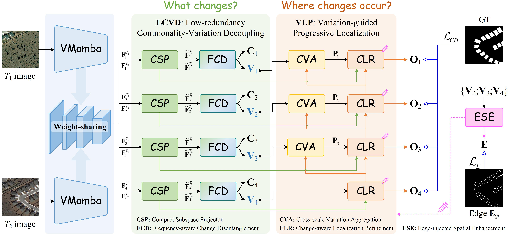
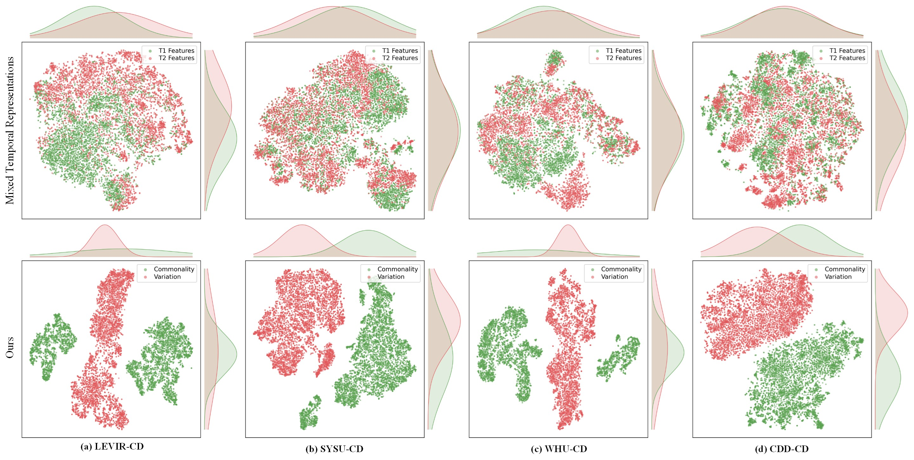
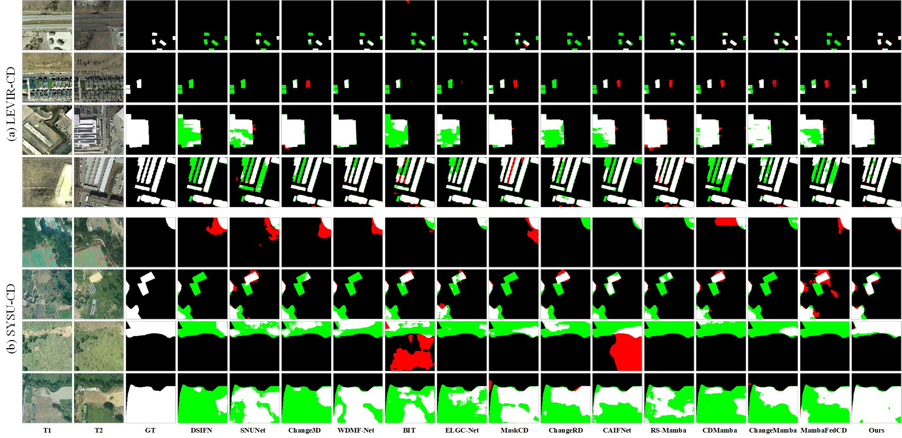
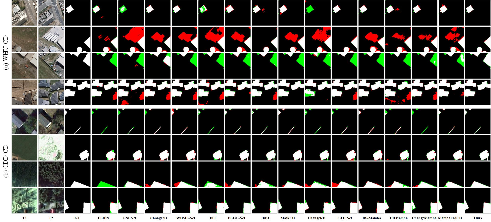

# Disentangle-to-Localize: Commonality-Variation Learning for Remote Sensing Change Detection


<p align="center">
  
  
  
  
</p>
    

This repository provides the official implementation of: **Disentangle-to-Localize: Commonality-Variation Learning for Remote Sensing Change Detection.**

> **What changes?** → **Where changes occur?**

CoVaL decouples bi-temporal features into commonality and variation representations, and then progressively localizes changed regions using variation-driven spatial reasoning.

<p align="center">
  
</p>

## ✨ Overview
Remote sensing change detection (RSCD) aims to identify genuine land-cover changes from bi-temporal images.
However, discrepancies caused by illumination, seasonality, weather, and atmospheric conditions may resemble real changes and produce **pseudo-change responses**.
Existing methods typically fuse or difference bi-temporal features directly, leaving temporally shared content, genuine change cues, and nuisance-induced discrepancies highly entangled. 
Consequently, distinguishing true changes from pseudo changes remains a fundamental challenge.


To address this issue, we propose **CoVaL**, a compact commonality–variation learning framework.

- **Stage I: LCVD**  
  Low-redundancy Commonality–Variation Decoupling answers **“what changes?”** by separating invariant commonality from change-sensitive variation.

- **Stage II: VPL**  
  Variation-guided Progressive Localization answers **“where changes occur?”** by progressively decoding variation features from deep semantic levels to shallow spatial details.

---


## :pushpin:  Installation
```bash
conda create -n coval python=3.10 pip -y
conda activate coval
pip install torch==2.5.1 torchvision==0.20.1 --index-url https://download.pytorch.org/whl/cu121
pip install selective-scan==0.0.2
pip install -r requirements.txt
```

### Pretrained Weight

The VMamba Tiny backbone weight (`vssm_tiny_0230_ckpt_epoch_262.pth`, 118 MB) is not included due to GitHub file size limits.

Download from:  
🔗 [vssm_tiny_0230_ckpt_epoch_262.pth](https://github.com/VisionVerse/CoVaL/releases/download/v1.0.0/vssm_tiny_0230_ckpt_epoch_262.pth)

Place it under `pretrained_weight/`:

```text
pretrained_weight/
└── vssm_tiny_0230_ckpt_epoch_262.pth
```


## :open_file_folder: Dataset Preparation

Each dataset follows a unified `A/B/label/list` structure:

```text
dataset/
├── A/
├── B/
├── label/
└── list/
    ├── train.txt
    ├── val.txt
    └── test.txt
```

- `A/` — images at time T1
- `B/` — images at time T2
- `label/` — binary change masks (0 = unchanged, 255 = changed)
- `list/` — per-line filenames (no path prefix) for train/val/test splits

The data loader supports flexible matching: a filename `train_001` in the list matches `train_001.png`, `train_001.jpg`, `001.png`, etc.

---

## :hourglass_flowing_sand: Training

```bash
python train.py \
  --cfg configs/vssm_tiny_224.yaml \
  --dataset_path /path/to/dataset \
  --dataset LEVIR-CD \
  --pretrained_weight_path pretrained_weight/vssm_tiny_0230_ckpt_epoch_262.pth
```

Key parameters:

| Parameter | Default | Description |
|-----------|---------|-------------|
| `--cfg` | required | YAML config path |
| `--dataset_path` | required | Dataset root directory |
| `--dataset` | LEVIR-CD | Dataset name |
| `--batch_size` | 12 | Batch size per GPU |
| `--max_iters` | 50000 | Training iterations |
| `--pretrained_weight_path` | '' | VMamba pretrained weight |


## :bar_chart:  Testing

```bash
python test.py \
  --cfg configs/vssm_tiny_224.yaml \
  --test_dataset_path /path/to/dataset \
  --test_data_list_path /path/to/dataset/list/test.txt \
  --resume saved_models/CoVaL_run/best_model_f1_xxxx.pth \
  --dataset LEVIR-CD \
  --batch_size 1
```

With post-processing:

```bash
python test.py \
  --cfg configs/vssm_tiny_224.yaml \
  --test_dataset_path /path/to/dataset \
  --test_data_list_path /path/to/dataset/list/test.txt \
  --resume saved_models/CoVaL_run/best_model_f1_xxxx.pth \
  --dataset LEVIR-CD \
  --use_post_processing \
  --post_min_area 50
```

The predicted change maps and evaluation metrics will be saved in:

```text
results/
└── CoVaL/
    ├── change_map/
    └── summary_metrics.txt
```

---

## Results

t-SNE results across four datasets show that CoVaL separates entangled bi-temporal features into compact commonality and variation clusters, enabling more discriminative change representation.
<p align="center">
  
</p>


CoVaL produces accurate and structurally consistent change maps, especially in challenging cases with complex backgrounds, small changed regions, and blurred boundaries.

<p align="center">
  
  
</p>


## Repository Structure

```text
CoVaL/
├── train.py                          # Training entry point
├── test.py                           # Inference entry point
├── requirements.txt
├── .gitignore
├── configs/
│   ├── config.py
│   └── vssm_tiny_224.yaml
├── datasets/
│   ├── imutils.py
│   └── make_data_loader.py
├── models/
│   ├── coval.py                      # CoVaLModel (main)
│   ├── lcvd.py                       # Stage I: CSP + FCD
│   ├── vpl.py                        # Stage II: CVA + CLR + ESE
│   └── backbone/
│       ├── coval_backbone.py         # CoVaLBackbone
│       ├── vmamba.py                 # VSSM / SS2D
│       └── csm_triton.py             # Triton cross-scan
├── losses/
│   ├── edge_loss.py
│   └── lovasz_loss.py
├── utils/
│   ├── metrics.py
│   └── post_processing.py
├── assets/
│   └── images/
│       ├── CoVaL_framework.jpg
│       ├── Visualization_Result_1.jpg
│       └── Visualization_Result_2.jpg
├── kernels/
│   └── selective_scan/               # CUDA kernels
├── classification/                    # VMamba reference
├── pretrained_weight/
└── docs/
```


## Acknowledgement

This project is built upon several excellent open-source repositories and remote sensing change detection benchmarks. We sincerely thank the authors for their contributions.


